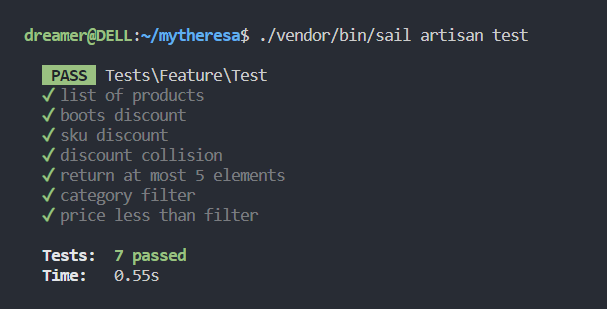

# Mytheresa Coding Challenge

## How to run the project and tests?

**Docker is required to run the project**

Run project:

    ./vendor/bin/sail up

Run migrations and data seeding:

    ./vendor/bin/sail artisan migrate:fresh --seed

Run tests:

    ./vendor/bin/sail artisan test

## Endpoint

`http://localhost/products`

## Explanations

* The PHP framework **Laravel** was chosen for this project
* **Postgres** database is used to store data
* Category is a model and the discount is set at the database level
* Discount for products with a certain SKU is also set at the database level
* The approach in which all discounts are set at the database level allows us to be very flexible and set the necessary discounts without changing the code base
* For each test case, we fill the test database with the necessary data set for this particular case
* Below is a list of affected files
    * Controllers:
        * `app/Http/Controllers/ProductController.php`
    * Resources:
        * `app/Http/Resources/ProductResource.php`
        * `app/Http/Resources/ProductsCollection.php`
    * Models:
        * `app/Models/Category.php`
        * `app/Models/Product.php`
    * Migrations:
        * `database/migrations/*`
    * Seeders:
        * `database/seeders/*`
    * Routes:
        * `routes/web.php`
    * Tests:
        * `tests/Feature/Test.php`
* The code contains comments related to the task conditions

## Thank you for viewing the project!